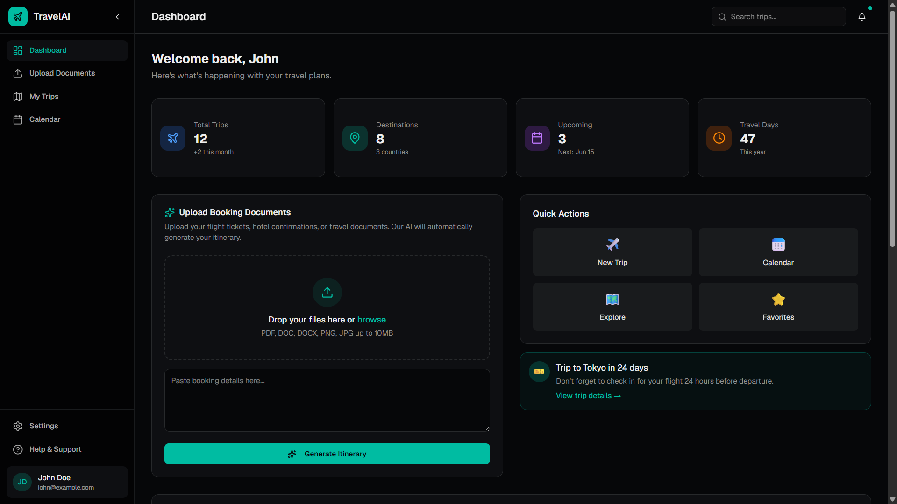
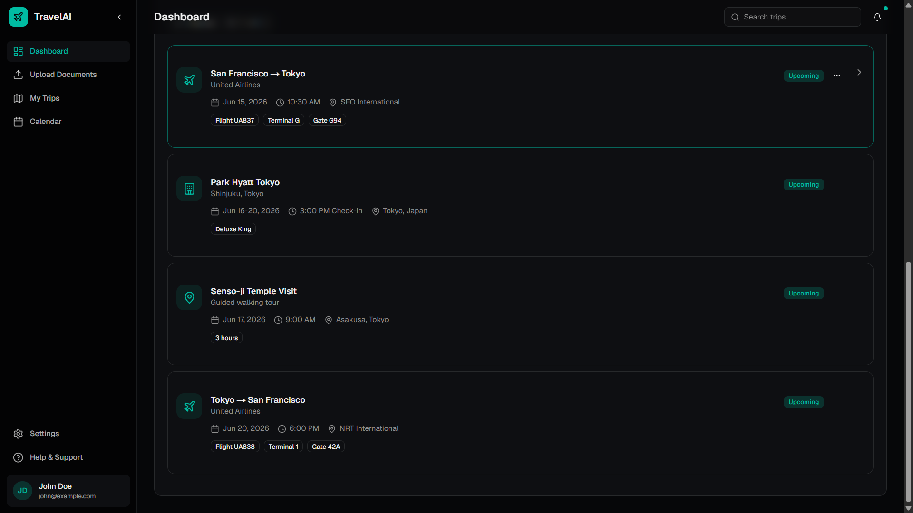

# MERN AI Itinerary Generator

AI-powered travel itinerary generator built with the MERN stack and Next.js frontend.

## Features

- JWT Authentication
- Protected Routes
- AI-generated travel itineraries
- Booking text upload & parsing
- Flight and hotel extraction
- Day-wise itinerary generation
- Travel recommendations
- MongoDB itinerary storage
- Responsive modern UI

---

## Tech Stack

### Frontend

- Next.js
- TypeScript
- Tailwind CSS
- shadcn/ui

### Backend

- Node.js
- Express.js
- MongoDB
- Mongoose
- JWT Authentication

### AI

- Google Gemini API

---

## Folder Structure

```bash
client/   # Next.js frontend
server/   # Express backend
```

---

## Backend Setup

```bash
cd server
npm install
npm run dev
```

---

## Frontend Setup

```bash
cd client
npm install
npm run dev
```

---

## Environment Variables

Create a `.env` file inside `server/`

```env
PORT=5000
MONGODB_URI=
JWT_SECRET=
GEMINI_API_KEY=
```

Create a `.env.local` file inside `client/`

```env
NEXT_PUBLIC_API_URL=http://localhost:5000
```

---

## API Routes

### Auth

- `POST /api/auth/register`
- `POST /api/auth/login`

### Itineraries

- `POST /api/itineraries/generate`
- `GET /api/itineraries`
- `GET /api/itineraries/:id`
- `DELETE /api/itineraries/:id`

---

## Current Status

- ✅ Authentication system completed
- ✅ Protected routes implemented
- ✅ AI itinerary generation integrated
- ✅ Frontend dashboard completed
- ✅ Backend API integration completed
- 🚧 File parsing automation in progress

---

## Screenshots

### Dashboard



### Generated Itinerary



---

## Future Improvements

- Real PDF parsing
- OCR support for images
- Export itinerary as PDF
- Email itinerary sharing
- Interactive maps integration
- Real-time flight tracking
